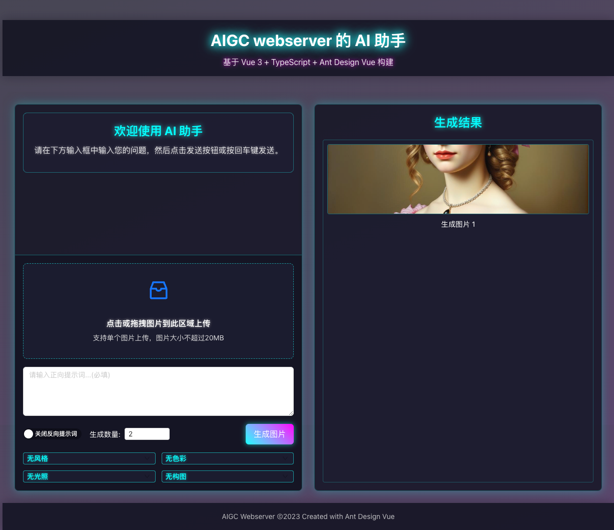

# AIGC Webserver - AI 图像生成助手

AIGC Webserver 是一个基于 Vue 3 和 FastAPI 构建的全栈应用，提供 AI 图像生成服务。前端采用赛博朋克风格的用户界面，后端集成了 Together AI 的图像生成 API，支持文本到图像（Text-to-Image）和图像到图像（Image-to-Image）的生成功能。



## 项目架构

项目分为前端和后端两个部分：

### 前端（Vue 3 + TypeScript）

- 提供用户友好的界面，支持提示词输入、图片上传和预览
- 支持正向和反向提示词系统
- 内置多种风格、色彩、光照和构图选项
- 响应式设计，适配不同设备尺寸
- 支持深色模式

### 后端（Python + FastAPI）

- 提供 RESTful API 接口
- 集成 Together AI 的 FLUX 模型进行图像生成
- 支持文本到图像和图像到图像的转换
- 使用 S3 存储生成的图像
- 提供提示词优化功能

## 技术栈

### 前端技术栈

- **框架**: [Vue 3](https://v3.cn.vuejs.org/) (使用组合式 API)
- **语言**: [TypeScript](https://www.typescriptlang.org/)
- **构建工具**: [Vite](https://cn.vitejs.dev/)
- **UI 组件库**: [Ant Design Vue](https://antdv.com/)
- **路由管理**: [Vue Router](https://router.vuejs.org/zh/)
- **状态管理**: [Pinia](https://pinia.vuejs.org/zh/)
- **HTTP 客户端**: [Axios](https://axios-http.com/)

### 后端技术栈

- **框架**: [FastAPI](https://fastapi.tiangolo.com/)
- **服务器**: [Uvicorn](https://www.uvicorn.org/)
- **AI 服务**: [Together AI](https://www.together.ai/) (FLUX 模型)
- **云存储**: [Amazon S3](https://aws.amazon.com/s3/)
- **环境变量管理**: [python-dotenv](https://pypi.org/project/python-dotenv/)
- **数据验证**: [Pydantic](https://pydantic-docs.helpmanual.io/)

## 功能特点

- 🖼️ **文本到图像生成**: 通过文字描述生成图像
- 🔄 **图像到图像转换**: 上传参考图片，生成新的变体
- 🎨 **风格选择器**: 内置多种艺术风格选项
- 🌈 **色彩选择器**: 控制生成图像的色彩风格
- 💡 **光照选择器**: 设置图像的光照效果
- 📐 **构图选择器**: 选择图像的构图方式
- 🔍 **提示词优化**: 自动优化用户输入的提示词
- 📱 **响应式设计**: 适配桌面和移动设备
- 🌓 **深色模式**: 自动适应系统深色模式

## 部署指南

### 前端部署

#### 方法一：传统部署

1. **构建生产版本**

```bash
# 安装依赖
npm install

# 构建生产环境版本
npm run build
```

2. **使用部署脚本**

我们提供了一个自动化部署脚本，可以简化部署过程：

```bash
# 赋予脚本执行权限
chmod +x deploy.sh

# 执行部署脚本（默认生产环境）
./deploy.sh

# 或指定测试环境
./deploy.sh test
```

3. **手动部署到 Nginx**

将构建生成的 `dist` 目录内容复制到 Nginx 的网站根目录：

```bash
# 复制构建结果到 Nginx 目录
sudo cp -r dist/* /usr/share/nginx/html/

# 复制 Nginx 配置
sudo cp nginx.conf /etc/nginx/nginx.conf

# 重启 Nginx
sudo systemctl restart nginx
```

#### 方法二：Docker 部署

1. **使用 Docker 构建和运行**

```bash
# 构建 Docker 镜像
docker build -t aigc-frontend .

# 运行容器
docker run -d -p 80:80 --name aigc-frontend aigc-frontend
```

2. **使用 Docker Compose**

```bash
# 启动服务
docker-compose up -d

# 查看日志
docker-compose logs -f

# 停止服务
docker-compose down
```

### Nginx 配置说明

项目包含一个优化的 Nginx 配置文件 `nginx.conf`，主要特点：

- 单页应用路由支持
- 静态资源缓存优化
- GZIP 压缩
- API 代理配置
- 错误页面处理

如果您需要自定义 Nginx 配置，请修改 `nginx.conf` 文件中的相关设置。

### 环境变量配置

部署前请确保 `.env.production` 文件中的环境变量正确配置：

```
# 生产环境配置
NODE_ENV=production

# API 配置
VITE_APP_API_BASE_URL=https://您的后端服务器地址:端口
VITE_APP_API_PREFIX=/api
VITE_APP_USE_MOCK=false

# 其他生产环境特定配置
VITE_APP_ENV=production
VITE_APP_DEBUG=false
```

特别注意 `VITE_APP_API_BASE_URL` 需要设置为您实际的后端服务地址。

### 后端部署

1. **进入后端目录**

```bash
cd server
```

2. **创建虚拟环境**

```bash
python -m venv venv
source venv/bin/activate  # 在 Windows 上使用: venv\Scripts\activate
```

3. **安装依赖**

```bash
pip install -r requirements.txt
```

4. **配置环境变量**

复制 `.env.example` 文件为 `.env`，并填写必要的配置：

```
LOCAL_SERVER_URL = http://127.0.0.1:11002

# S3 配置
S3_ENDPOINT_URL=your_s3_endpoint
S3_ACCESS_KEY_ID=your_access_key
S3_SECRET_ACCESS_KEY=your_secret_key
S3_BUCKET_NAME=your_bucket_name
S3_MAX_FILE_SIZE=5m

# Together.ai 配置
TOGETHER_MODEL=black-forest-labs/FLUX.1-schnell-Free
TOGETHER_API_KEY=your_together_api_key

# 其他配置
MAX_IMAGE_COUNT=4
```

5. **启动服务器**

```bash
python main.py
```

服务器将在 `http://127.0.0.1:11002` 上运行。

## API 接口文档

### 图像生成接口

**端点**: `/image_generation`

**方法**: POST

**请求参数**:

```json
{
  "prompt": "一只可爱的猫咪",
  "negativePrompt": "模糊, 扭曲",
  "stylePrompt": "写实风格",
  "colorPrompt": "明亮色彩",
  "lightPrompt": "自然光",
  "compositionPrompt": "居中构图",
  "count": 1,
  "referenceImage": "base64编码的图片"
}
```

**响应**:

```json
{
  "code": 200,
  "message": "成功",
  "data": [
    {
      "id": 1678942345,
      "url": "https://your-bucket.s3.amazonaws.com/images/cat_1.jpg",
      "title": "生成图片 1",
      "createdAt": "2023-03-16T12:34:56.789Z"
    }
  ]
}
```

## 开发指南

### 前端开发

- 组件位于 `src/components` 目录
- 页面视图位于 `src/views` 目录
- API 调用位于 `src/api` 目录
- 工具函数位于 `src/utils` 目录

### 后端开发

- 主应用入口为 `server/main.py`
- API 路由定义在 `server/source/routers.py`
- 数据模型定义在 `server/source/models.py`
- 图像生成算法实现在 `server/source/algorithm.py`

## 注意事项

- 确保已注册 [Together AI](https://www.together.ai/) 账号并获取 API 密钥
- 图像生成数量限制为 4 张，可在 `.env` 文件中的 `MAX_IMAGE_COUNT` 修改
- 上传图片大小限制为 20MB
- 默认使用 FLUX.1-schnell-Free 模型，可根据需要在 `.env` 中更改

## 许可证

[MIT License](LICENSE)

## 贡献指南

欢迎贡献代码、报告问题或提出新功能建议。请遵循以下步骤：

1. Fork 项目
2. 创建功能分支 (`git checkout -b feature/amazing-feature`)
3. 提交更改 (`git commit -m 'Add some amazing feature'`)
4. 推送到分支 (`git push origin feature/amazing-feature`)
5. 创建 Pull Request


## 贡献者

感谢以下开发者对本项目的贡献：

<table>
  <tr>
    <td align="center">
      <a href="https://github.com/freedanfan">
        
        <br />
        <sub><b>freedanfan</b></sub>
      </a>
      <br />
      <a href="mailto:freedanfan@gmail.com">freedanfan@gmail.com</a>
    </td>
    <td align="center">
      <a href="https://github.com/eiang">
        
        <br />
        <sub><b>eiang</b></sub>
      </a>
      <br />
      <a href="mailto:iheqiang1021@gmail.com">iheqiang1021@gmail.com</a>
    </td>
  </tr>
</table>

## 联系我们

如有任何问题或建议，请通过以下方式联系我们：

- 提交 [GitHub Issue](https://github.com/freedanfan/aigc_webserver/issues)
- 发送邮件至项目维护者

## 环境配置

项目支持多环境配置，可以根据不同的环境使用不同的配置：

### 环境文件

- `.env`: 所有环境共享的变量
- `.env.development`: 开发环境配置
- `.env.test`: 测试环境配置
- `.env.production`: 生产环境配置

### 主要配置项

- `VITE_APP_API_BASE_URL`: API 服务器地址
- `VITE_APP_API_PREFIX`: API 请求前缀
- `VITE_APP_USE_MOCK`: 是否使用模拟数据
- `VITE_APP_ENV`: 环境标识
- `VITE_APP_DEBUG`: 是否开启调试模式

## 项目结构

```
aigc_webserver/
├── public/              # 静态资源
├── src/                 # 源代码
│   ├── api/             # API 接口
│   │   ├── modules/     # API 模块
│   │   └── types.ts     # API 类型定义
│   │   
│   ├── assets/          # 资源文件
│   ├── components/      # 公共组件
│   ├── router/          # 路由配置
│   ├── stores/          # 状态管理
│   ├── utils/           # 工具函数
│   │   ├── config.ts    # 配置工具
│   │   └── request.ts   # 请求工具
│   ├── views/           # 页面组件
│   ├── App.vue          # 根组件
│   └── main.ts          # 入口文件
├── .env                 # 环境变量（所有环境）
├── .env.development     # 开发环境变量
├── .env.test            # 测试环境变量
├── .env.production      # 生产环境变量
├── index.html           # HTML 模板
├── tsconfig.json        # TypeScript 配置
├── vite.config.ts       # Vite 配置
└── package.json         # 项目依赖
```

## API 模拟数据

项目支持使用模拟数据进行开发，可以在不依赖后端服务的情况下进行前端开发。

- 在 `.env.development` 中设置 `VITE_APP_USE_MOCK=true` 开启模拟数据
- 模拟数据实现在 `src/api/modules/` 目录下的各个模块中

## 代理配置

在开发环境中，通过 Vite 的代理功能将 API 请求转发到后端服务：

```javascript
// vite.config.ts
export default defineConfig(({ mode }) => {
  // 加载环境变量
  const env = loadEnv(mode, process.cwd())
  
  // 获取环境变量
  const apiBaseUrl = env.VITE_APP_API_BASE_URL || 'http://localhost:11002'
  const apiPrefix = env.VITE_APP_API_PREFIX || '/api'
  
  return {
    // ...
    server: {
      proxy: {
        [apiPrefix]: {
          target: apiBaseUrl,
          changeOrigin: true,
          rewrite: (path) => path.replace(new RegExp(`^${apiPrefix}`), ''),
        }
      }
    }
  }
})
```
